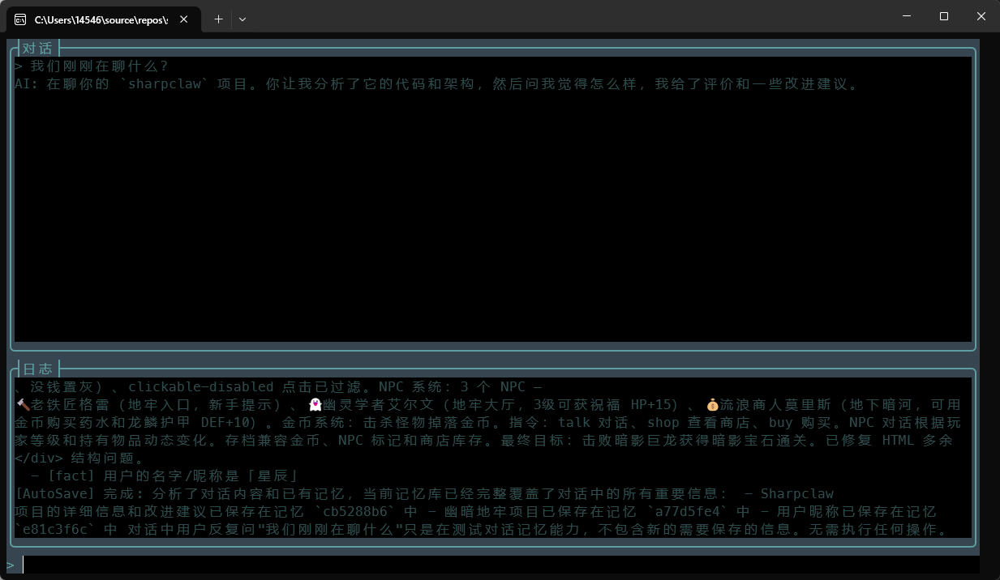
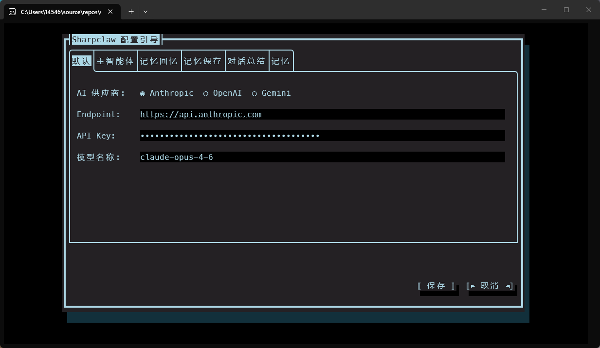
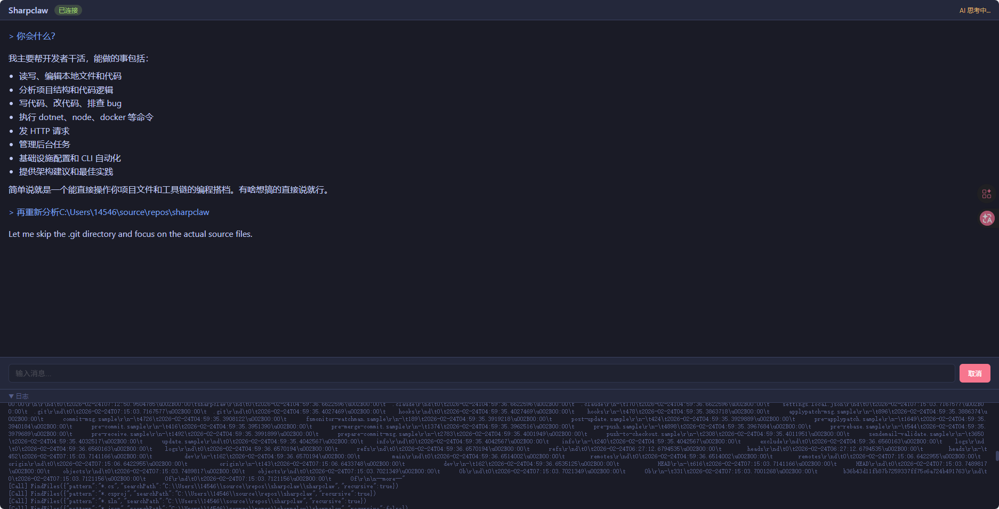

# Sharpclaw

[中文版](README_CN.md)

A .NET 10 AI agent with long-term memory and system operation tools. Supports Anthropic Claude, OpenAI, and Gemini multi-provider switching, with Alibaba Cloud DashScope for vector embedding and reranking.



## Features

- **Multi-provider support** — Anthropic / OpenAI / Gemini, switch via config without code changes
- **Per-agent configuration** — Each agent (main, memory recall, memory save, summarizer) can use different API endpoints, keys, and models
- **Long-term memory** — Automatically saves, retrieves, and injects important information from conversations, persisted across sessions
- **Memory pipeline** — Four independent sub-agents collaborate: proactive memory saving, memory recall injection, sliding window trimming, conversation summarization
- **Vector semantic search** — Two-phase retrieval: vector embedding recall + optional reranking
- **Semantic deduplication** — Automatically merges memories when cosine similarity exceeds threshold, avoiding redundancy
- **System tools** — File operations, process execution (dotnet/node/docker), HTTP requests, background task management
- **Dual frontend** — TUI terminal interface (Terminal.Gui v2) + WebSocket web interface, sharing the same agent logic
- **Slash commands** — Type `/` to trigger autocomplete, supports `/exit`, `/quit` and more
- **Streaming output** — Real-time streaming AI responses with reasoning logs and tool call tracing
- **Config data encryption** — Sensitive data like API keys are encrypted with AES-256-CBC, with encryption keys stored in the OS credential manager (Windows Credential Manager / macOS Keychain / Linux libsecret)

## Requirements

- .NET 10 SDK

## Quick Start

### TUI Mode (Terminal Interface)

```bash
dotnet run --project sharpclaw
```

First run automatically launches the configuration wizard. Select your AI provider, enter API keys, and configure per-agent settings.



Config is saved to `~/.sharpclaw/config.json`. After that, launching goes straight to interactive chat. Type `/exit` or `/quit` to exit, `Ctrl+Q` to quit.

### Web Mode (WebSocket Server)

```bash
dotnet run --project sharpclaw serve
dotnet run --project sharpclaw serve --port 8080
```

Visit `http://localhost:5000` (default port) to open the web chat interface. The Web UI supports Markdown rendering, code highlighting, connection status indicators, and real-time status display.



> Note: Web mode requires completing configuration via TUI mode first. Only one client connection is supported at a time.

## Configuration

Run the config wizard:

```bash
dotnet run --project sharpclaw config
```

Config file structure (`~/.sharpclaw/config.json`):

```json
{
  "version": 4,
  "default": {
    "provider": "anthropic",
    "endpoint": "https://api.anthropic.com",
    "apiKey": "sk-xxx",
    "model": "claude-opus-4-6"
  },
  "agents": {
    "main": {},
    "recaller": { "enabled": true },
    "saver": { "enabled": true, "model": "claude-haiku-4-5-20251001" },
    "summarizer": { "enabled": true, "model": "claude-haiku-4-5-20251001" }
  },
  "memory": {
    "enabled": true,
    "embeddingEndpoint": "https://dashscope.aliyuncs.com/compatible-mode/v1",
    "embeddingApiKey": "sk-xxx",
    "embeddingModel": "text-embedding-v4",
    "rerankEnabled": true,
    "rerankEndpoint": "https://dashscope.aliyuncs.com/compatible-api/v1/reranks",
    "rerankApiKey": "sk-xxx",
    "rerankModel": "qwen3-vl-rerank"
  }
}
```

Each agent inherits from `default` unless overridden. Set `"enabled": false` to disable a sub-agent.

## Memory Pipeline

Processing flow per conversation turn:

```
User Input
  |
  +- MemoryRecaller    Recall: retrieve relevant memories, inject into context
  |
  +- Agent Response    Main agent processes (can call SearchMemory/GetRecentMemories tools)
  |
  +- SlidingWindowChatReducer (AfterMessageAdded)
       +- MemorySaver            Proactive save: analyze conversation, save/update/delete memories
       +- Strip old injected messages
       +- Sliding window trim    Triggered when exceeding windowSize + buffer
       +- ConversationSummarizer Summarize trimmed conversation, inject summary
```

## Project Structure

```
sharpclaw/
├── Program.cs                  # Entry point: TUI / Web mode dispatch
├── Abstractions/               # Interface definitions
│   ├── IChatIO.cs              # Frontend I/O abstraction (shared by TUI and WebSocket)
│   └── IAppLogger.cs           # Logger abstraction
├── Agents/                     # Agents
│   ├── MainAgent.cs            # Main agent: conversation loop, streaming, tool calls
│   ├── MemoryRecaller.cs       # Memory recall: incremental injection of relevant memories
│   ├── MemorySaver.cs          # Memory save: analyze conversation, auto save/update/delete
│   └── ConversationSummarizer.cs # Conversation summarizer: incremental summary of trimmed content
├── Chat/
│   └── SlidingWindowChatReducer.cs # Sliding window reducer with integrated memory pipeline
├── Clients/
│   └── DashScopeRerankClient.cs    # Alibaba Cloud DashScope reranking client
├── Commands/                   # System tools (registered as AIFunction)
│   ├── FileCommands.cs         # File operations: read, write, search, edit
│   ├── HttpCommands.cs         # HTTP requests
│   ├── ProcessCommands.cs      # Process execution: dotnet/node/docker
│   ├── SystemCommands.cs       # System info, exit
│   └── TaskCommands.cs         # Background task management
├── Core/
│   ├── AgentBootstrap.cs       # Shared initialization logic
│   ├── ClientFactory.cs        # Multi-provider AI client factory
│   ├── DataProtector.cs        # AES-256-CBC encryption/decryption
│   ├── KeyStore.cs             # OS credential manager key storage
│   ├── SharpclawConfig.cs      # Config management (version migration, encryption)
│   ├── Serialization/          # JSON serialization
│   └── TaskManagement/         # Background tasks: process tasks, native tasks
├── Memory/
│   ├── IMemoryStore.cs         # Memory store interface
│   ├── MemoryEntry.cs          # Memory entry model
│   ├── VectorMemoryStore.cs    # Vector memory store (embedding + cosine + dedup + rerank)
│   └── InMemoryMemoryStore.cs  # In-memory store (for testing)
├── UI/                         # TUI frontend
│   ├── ChatWindow.cs           # Main chat window (chat + log + input areas)
│   ├── ConfigDialog.cs         # Config wizard dialog (TabView pages)
│   ├── SlashCommandSuggestionGenerator.cs # Slash command autocomplete
│   ├── AppLogger.cs            # Logger management
│   └── TerminalGuiLogger.cs    # TUI logger implementation
├── Web/                        # WebSocket frontend
│   ├── WebServer.cs            # ASP.NET Core host
│   ├── WebSocketChatIO.cs      # WebSocket IChatIO implementation
│   ├── WebSocketSender.cs      # WebSocket message sender
│   └── WebSocketLogger.cs      # WebSocket logger implementation
└── wwwroot/
    └── index.html              # Web chat interface (single-file SPA)
```

## Data Persistence

- `~/.sharpclaw/config.json` — Provider and agent configuration
- `history.json` — Session state, auto-restored on startup
- `memories.json` — Vector memory store
