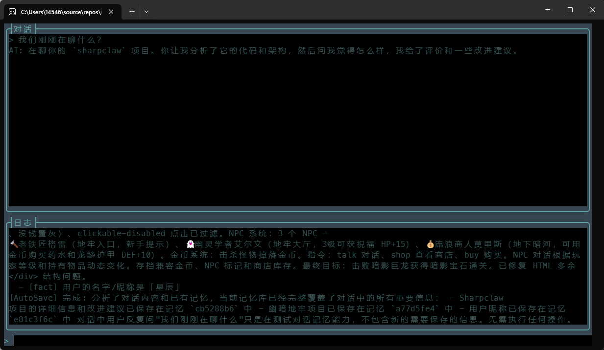
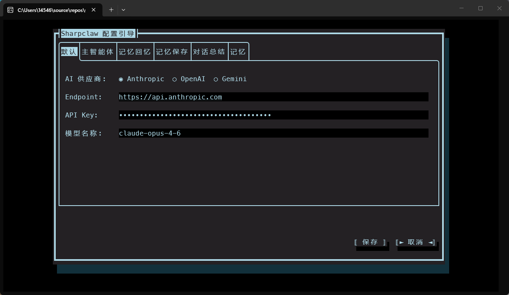
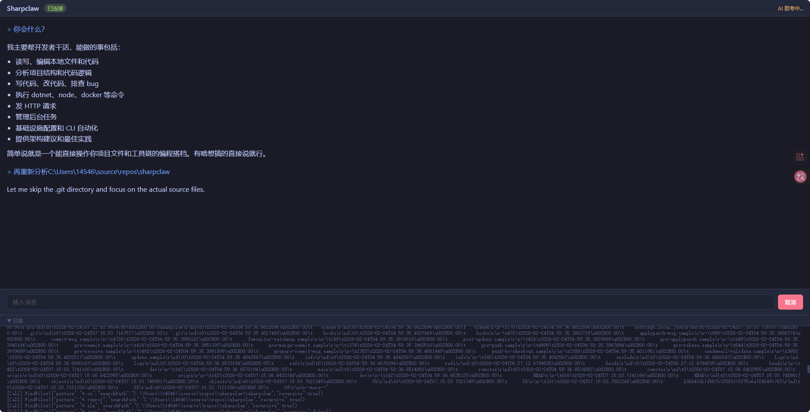

# 🐾 Sharpclaw

[中文版](README_CN.md)

Sharpclaw is an advanced, highly capable **autonomous AI agent framework** built on **.NET 10**. Its core distinctiveness lies in its robust **cross-conversation long-term memory system** and **system-level operation capabilities**.

By leveraging the `Microsoft.Extensions.AI` abstraction layer, Sharpclaw seamlessly integrates with multiple LLM providers (Anthropic, OpenAI, Gemini) and interacts with users through multiple frontend channels including a Terminal UI (TUI), a Web interface, and QQ Bots.



---

## ✨ Key Features

### 🧠 Multi-Tier Long-Term Memory System

* **Three-Layer Pipeline:** Automatically manages context through Working Memory (current session) → Recent Memory (detailed summaries) → Primary Memory (consolidated core facts).
* **Agentic Memory Saver:** An autonomous background agent actively decides what to save, update, or delete after each conversation turn.
* **Vector Database Integration:** Built-in vector search powered by [Sharc](https://github.com/revred/sharc.git) and SQLite, featuring semantic deduplication and a 2-stage retrieval process (Vector Search + DashScope Rerank).

### 🛠️ System Operation Capabilities (Tools/Commands)

* **File System:** Comprehensive file operations including searching, reading, appending, editing, and directory management.
* **Process & Task Management:** Execute native OS commands, external processes, HTTP requests, and manage background tasks. Tasks support foreground (blocking) and background modes, with full lifecycle management including output streaming (stdout/stderr/combined), stdin writing, keyword/regex-based output waiting, and process tree termination. All background tasks are automatically killed and cleaned up on application exit.
* **Sandboxed Python:** Run Python code safely inside a WASM sandbox (see [WASM Python Sandbox](#-wasm-python-sandbox) below).

### 🐍 WASM Python Sandbox

* **Sandboxed Execution:** Runs Python code inside a [RustPython](https://github.com/RustPython/RustPython) WASM module via **Wasmtime** (primary) or **Wasmer** (fallback) runtimes, providing strong hardware-level isolation from the host process.
* **Filesystem Isolation:** File access is strictly limited to `/workspace` (the agent's working directory) and an isolated per-run temporary directory via [WASI](https://wasi.dev/) capability-based security. The host filesystem is completely inaccessible.
* **Guaranteed Timeout:** Wasmtime's **epoch interruption** mechanism enforces a hard, non-bypassable execution timeout (default 180 s), preventing infinite loops and CPU exhaustion.
* **No Shell Injection:** `stdout`/`stderr` are captured at the WASI syscall level via native callbacks, completely bypassing the host shell and eliminating shell-injection risks.
* **Per-Execution Isolation:** Every run creates a fresh WASM engine instance inside a unique GUID-named temporary directory, which is automatically deleted after completion — no state leaks between invocations.

### 📱 Multi-Channel Support

* **TUI (Terminal.Gui):** A feature-rich terminal interface with collapsible logs, slash-command auto-completion, and configuration dialogs.
* **Web (WebSocket):** A lightweight ASP.NET Core web server with a modern UI (Tokyo Night theme) and real-time streaming.
* **QQ Bot:** Native integration with QQ channels, groups, and private messages.

### 🔌 Extensible Skills System

* **External Skills:** Load custom skills from `~/.sharpclaw/skills/` via `AgentSkillsDotNet`, seamlessly merged with built-in commands as a unified tool collection.

### 🔒 Secure Configuration

* Cross-platform secure credential storage (Windows Credential Manager, macOS Keychain, Linux libsecret) using AES-256-CBC encryption for API keys.
* Automatic configuration version migration (up to v8).
* Per-provider custom request body injection (e.g. `"thinking"`, `"reasoning_split"`) — configurable globally or per-agent via the Config Dialog.

---

## 🚀 Getting Started

### Prerequisites

* [.NET 10.0 SDK](https://dotnet.microsoft.com/)
* Git (for cloning submodules)

### Build and Run

1. Clone the repository with its submodules:
```bash
git clone --recursive https://github.com/yourusername/sharpclaw.git
cd sharpclaw
```

2. Build the entire solution:
```bash
dotnet build
```

3. Run the application via the CLI. Sharpclaw routes the startup based on the command provided:

* **Start Terminal UI (Default):**
```bash
dotnet run --project sharpclaw tui
```
First run automatically launches the configuration wizard:



* **Start Web Server:**
```bash
dotnet run --project sharpclaw web
```



* **Start QQ Bot:**
```bash
dotnet run --project sharpclaw qqbot
```

* **Open Configuration UI:**
```bash
dotnet run --project sharpclaw config
```

---

## 🏗️ Architecture

### System Architecture

```
┌─────────────────────────────────────────────────────────────┐
│  Frontend Layer (Channels/)                                  │
│  ├── Tui/ — Terminal.Gui v2 (ChatWindow, ConfigDialog)      │
│  ├── Web/ — ASP.NET Core WebSocket server                   │
│  └── QQBot/ — QQ Bot integration (Luolan.QQBot)             │
├─────────────────────────────────────────────────────────────┤
│  Agent Layer (Agents/)                                       │
│  ├── MainAgent — Conversation loop, tool orchestration      │
│  ├── MemorySaver — Autonomous memory management             │
│  └── ConversationArchiver — Two-phase memory consolidation  │
├─────────────────────────────────────────────────────────────┤
│  Memory Pipeline (Chat/, Memory/)                            │
│  ├── MemoryPipelineChatReducer — Context window management  │
│  ├── VectorMemoryStore — Sharc + SQLite vector search       │
│  └── InMemoryMemoryStore — Keyword-based fallback           │
├─────────────────────────────────────────────────────────────┤
│  Skills & Commands (Commands/, ~/.sharpclaw/skills/)         │
│  ├── Built-in — File, Process, HTTP, Task, System commands  │
│  ├── External Skills — AgentSkillsDotNet plugin loading     │
│  └── Memory Tools — SearchMemory, GetRecentMemories         │
├─────────────────────────────────────────────────────────────┤
│  WASM Python Sandbox (Services/, Interop/, libs/)            │
│  ├── WasmtimePythonService — RunPython tool (primary)       │
│  ├── WasmtimeWasiRuntime — Epoch-timeout WASM executor      │
│  ├── WasmerWasiRuntime — Fallback WASM executor             │
│  └── rustpython.wasm — Embedded Python 3 interpreter        │
├─────────────────────────────────────────────────────────────┤
│  Core Infrastructure (Core/)                                 │
│  ├── AgentBootstrap — Shared initialization + skill loading │
│  ├── SharpclawConfig — Configuration with encryption        │
│  ├── ClientFactory — LLM client creation                    │
│  ├── DataProtector/KeyStore — AES-256-CBC encryption        │
│  └── TaskManager — Background process management            │
└─────────────────────────────────────────────────────────────┘
```

### Memory System

Sharpclaw implements a sophisticated three-layer memory pipeline:

| Layer | File | Purpose |
|-------|------|---------|
| **Working Memory** | `working_memory.json` | Current conversation snapshot |
| **Recent Memory** | `recent_memory.md` | Detailed summaries (append-only) |
| **Primary Memory** | `primary_memory.md` | Consolidated core facts |
| **Vector Store** | `memories.db` | Semantic embeddings + metadata |
| **History** | `history/*.md` | Archived full conversations |

**Pipeline Flow:**
1. After each turn → MemorySaver analyzes and updates vector store
2. When context window overflows → Summarizer generates detailed summary → appends to recent memory
3. When recent memory > 30k chars → Consolidator extracts core info → overwrites primary memory

### IChatIO Abstraction

The AI engine is decoupled from frontend through `IChatIO` interface:
- **TUI:** `Channels/Tui/ChatWindow.cs` — Terminal.Gui v2 interface
- **Web:** `Channels/Web/WebSocketChatIO.cs` — WebSocket frontend
- **QQ Bot:** `Channels/QQBot/QQBotServer.cs` — QQ Bot interface

All frontends share the same `MainAgent` logic.

---

## 🛡️ WASM Python Sandbox

Sharpclaw provides a fully isolated, secure Python execution environment using **WebAssembly (WASM)** and **WASI** (WebAssembly System Interface). This allows the AI agent to generate and run Python code without any risk to the host system.

### Runtime Stack

| Component | Technology | Role |
|-----------|-----------|------|
| **Python Interpreter** | [RustPython](https://github.com/RustPython/RustPython) compiled to WASM | Python 3 runtime inside sandbox |
| **Primary Runtime** | [Wasmtime](https://wasmtime.dev/) v43 | WASM executor with epoch-based timeout |
| **Fallback Runtime** | [Wasmer](https://wasmer.io/) | Alternative executor |
| **System Interface** | WASI | Capability-based filesystem & I/O abstraction |

### Security Boundaries

| Boundary | Mechanism | Effect |
|----------|-----------|--------|
| **Filesystem** | WASI pre-opened directories | Only `/workspace` and a per-run `/sharpclaw_tmp` are accessible |
| **Memory** | WASM linear memory | Complete isolation from host process memory |
| **Execution Time** | Wasmtime epoch interruption | Hard, non-bypassable timeout (default 180 s) |
| **I/O** | WASI syscall-level callbacks | Output captured before reaching the host shell |
| **Concurrency** | `SemaphoreSlim` mutex | One Python execution at a time, preventing races |
| **State** | Fresh WASM instance per run | No shared state between invocations |

### Execution Flow

```
Agent calls RunPython(code, purpose, timeoutSeconds)
  │
  ▼
WasmtimePythonService (acquires mutex)
  │
  ▼
WasmtimeWasiRuntime.ExecuteCode()
  ├── Create isolated temp dir  (GUID-named, auto-deleted on finish)
  ├── Write user code to temp file
  ├── Init Wasmtime engine (epoch interruption enabled)
  ├── Configure WASI:
  │     ├── Pre-open /workspace  (rw)
  │     ├── Pre-open /sharpclaw_tmp  (rw)
  │     ├── Capture stdout/stderr via native callbacks
  │     └── Set env vars (PWD=/workspace only)
  ├── Instantiate rustpython.wasm  +  call _start
  ├── Start timeout watchdog (Task.Delay → increment epoch)
  └── Return WasmCommandResult { Success, ExitCode, StdOut, StdErr, TimedOut }
```

### Capability Matrix

| Capability | Status | Notes |
|-----------|--------|-------|
| Standard Python library | ✅ | Frozen into rustpython.wasm |
| File I/O in `/workspace` | ✅ | Maps to the agent's working directory on the host |
| Arbitrary computation | ✅ | No restrictions beyond timeout |
| Host filesystem (outside workspace) | ❌ | Blocked by WASI capability model |
| Native extensions (`.so`/`.dll`) | ❌ | WASM cannot load host shared libraries |
| Spawning host processes | ❌ | No `subprocess`/`os.system` to host |
| Unrestricted network access | ❌ | No WASI socket mapping by default |

---

## 📁 Project Structure

```
sharpclaw/
├── sharpclaw/                   ← Main project
│   ├── Program.cs               ← Entry point (tui/web/qqbot/config)
│   ├── sharpclaw.csproj         ← Project file (net10.0)
│   ├── Abstractions/            ← IChatIO, IAppLogger interfaces
│   ├── Agents/                  ← MainAgent, MemorySaver, ConversationArchiver
│   ├── Channels/                ← Tui, Web, QQBot frontends
│   ├── Chat/                    ← MemoryPipelineChatReducer
│   ├── Clients/                 ← DashScopeRerankClient, ExtraFieldsPolicy
│   ├── Commands/                ← All tool implementations
│   ├── Core/                    ← Config, Bootstrap, TaskManager
│   ├── Memory/                  ← IMemoryStore, VectorMemoryStore
│   ├── UI/                      ← ConfigDialog, AppLogger
│   └── wwwroot/                 ← Web UI (index.html)
├── preview/                     ← Screenshots
├── sharc/                       ← Submodule: high-performance SQLite library
│   ├── src/                     ← 9 project folders (Sharc, Sharc.Vector, etc.)
│   ├── tests/                   ← 11 test projects (3,467 tests)
│   ├── bench/                   ← BenchmarkDotNet suites
│   └── docs/                    ← Architecture & feature docs
├── CLAUDE.md                    ← AI assistant instructions
├── README.md / README_CN.md     ← Documentation
└── sharpclaw.slnx               ← Solution file
```

---

## 🔧 Configuration

Configuration is stored in `~/.sharpclaw/config.json` (version 8):

```json
{
  "version": 8,
  "default": {
    "provider": "anthropic",
    "apiKey": "...",
    "model": "claude-3-5-sonnet-20241022"
  },
  "agents": {
    "main": { "enabled": true },
    "recaller": { "enabled": true },
    "saver": { "enabled": true },
    "summarizer": { "enabled": true }
  },
  "memory": {
    "embeddingProvider": "openai",
    "embeddingModel": "text-embedding-3-small"
  },
  "channels": {
    "web": { "address": "127.0.0.1", "port": 5000 }
  }
}
```

- **API keys** encrypted at rest with AES-256-CBC
- **Encryption key** stored in OS credential manager
- **Per-agent overrides** can specify different provider/model
- **ExtraRequestBody** supports custom fields (e.g., `thinking`)

---

## 🧩 Sharc Submodule

Sharpclaw includes [Sharc](https://github.com/revred/sharc.git) as a submodule — a high-performance, pure managed C# library for reading/writing SQLite files:

- **Pure managed C#** — zero native dependencies
- **609x faster** B-tree seeks than Microsoft.Data.Sqlite
- **Zero allocation** per-row reads via `Span<T>`
- **Built-in features:** Encryption, Graph queries (Cypher), Vector search, SQL pipeline

See `sharc/README.md` and `sharc/CLAUDE.md` for details.

---

## 📝 License

This project is licensed under the MIT License - see the [LICENSE](LICENSE) file for details.

Copyright (c) 2025 sharpclaw.
